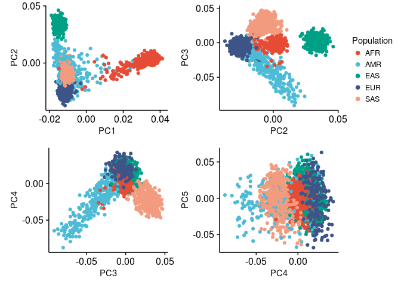

PCA
================

Submit PCA job using QTLtools. Here we use chr21 variants which have MAF&gt;0.05 and are at least 6kb distant of each other.

``` bash
qsub pca_qtltools.pbs
```

Process results in R

``` r
library(tidyverse)
library(scales)
library(cowplot)
```

``` r
kgp_individuals <- 
  "ftp://ftp.1000genomes.ebi.ac.uk/vol1/ftp/release/20130502/integrated_call_samples_v3.20130502.ALL.panel" %>%
  read_tsv(skip = 1, col_names = FALSE) %>%
  select(subject = X1, pop = X2, continental_pop = X3)

pcs <- 
    read_delim("./1000g.pca", delim = " ") %>%
    mutate(SampleID = sub("^.+_(PC\\d+)$", "\\1", SampleID)) %>%
    filter(SampleID %in% paste0("PC", 1:5)) %>%
    gather(subject, value, -1) %>%
    spread(SampleID, value) %>%
    mutate_at(vars(-subject), function(x) x/sqrt(sum(x^2))) %>%
    left_join(kgp_individuals, by = "subject")
```

Plot

``` r
make_pca_plot <- function(PC_x, PC_y) {
    
    ggplot(pcs, aes_string(PC_x, PC_y)) +
        geom_point(aes(color = continental_pop)) +
        ggsci::scale_color_npg() +
        scale_x_continuous(breaks = pretty_breaks(3)) +
        scale_y_continuous(breaks = pretty_breaks(3)) +
        guides(color = guide_legend(override.aes = list(size = 2))) +
        theme(text = element_text(size = 11)) +
        labs(color = "Population")
}

p1 <- make_pca_plot("PC1", "PC2")
p2 <- make_pca_plot("PC2", "PC3")
p3 <- make_pca_plot("PC3", "PC4")
p4 <- make_pca_plot("PC4", "PC5")

leg <- get_legend(p1)

pca_plot <- 
    plot_grid(p1 + guides(color = FALSE), 
              p2 + guides(color = FALSE), 
              leg,
              p3 + guides(color = FALSE), 
              p4 + guides(color = FALSE), 
              nrow = 2, ncol = 3, rel_widths = c(3, 3, 1))

pca_plot
```


